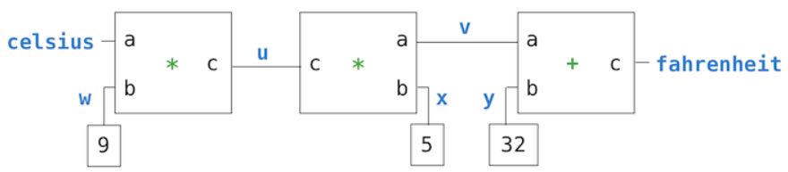

# Chapter 2
## 2.4 Mutable Data
Adding state to data is a central ingredient of a paradigm called object-oriented programming.

### 2.4.1 Object Metaphor
Functions: perform operation and data were operated upon. Can be manipulated as data, could also be called to perform computation.

Objects: combine data values with behavior.

### 2.4.2 Sequence Objects
Instance of primitive built-in values such as numbers are immutable. The values themselves cannot change over the course of program execution.

Lists are mutable.
```python
chinese = ['coin', 'string', 'myraid']
suits = chinese
```
这里的suits相当于chinese指向的序列的一个别名。对suits进行更改会影响chinese. The same list object is bound to `suits`
The behavior of mutable data is different from immutable data. With mutable data, methods called on one name can affect another name at the same time.

e.g.


**Copy**
lists can be copied using `list` constructor function. Changes to one lists do not affect another.
```python
nest = list(suits) # Bind "nest" to a second list with the same elements
nest[0] = suits # Create a nested list
```
In this situation, changing the list referenced by `suits` will affect the nseted list that is the first element of `nest`, but not the other elements.
```python
suits.insert(2, 'Jocker') # Insert an element at index 2, shifting the rest
nest
[['heart', 'diamond', 'Joker', 'spade', 'club'], 'diamond', 'spade', 'club']
```

**test whether two Objects are the same** 
`is` and `is not`, test whether two expressions in fact evaluate to the identical object.
```python
>>> suits is nest[0]
True
>>> suits is ['heart', 'diamond', 'spade', 'club']
False
>>> suits == ['heart', 'diamond', 'spade', 'club']
True
```

**List comprehensions**
List comprehension always creates a new list. `unicodedata` moudule tracks the official names of every character in the Unicode alphabet. 
```python
>>> from unicodedata import lookup
>>> [lookup('WHITE ' + s.upper() + ' SUIT') for s in suits]
['♡', '♢', '♤', '♧']
```

**Tuple**
Built in `tuple` type, is an immutable sequence.
While it is not possible to change which elements are in a tuple, it is possible to change the value of a mutable element contained within a tuple.

也就是说tuple实际上存贮了一个指向对象的指针，不能对tuple存储的指针进行操作，但如果这个指针指向可变数据的话，可以对这个可变数据进行操作。操作后的变化会自然而然反映在tuple上。

**Dictionaries**
Contain key-value pairs, both keys and values are objects. Provide an abstraction for storing and retrieving values that are indexed not by consecutive integers, but by descriptive keys.

```python
>>>numerals = {'I': 1.0, 'V': 5, 'X': 10}
>>>numerals['X']
10
```

A dictionary can have at most one value for each key. Adding new key-value pairs and changing the exsiting value gor a key can both be achieved with assignment statements.
```python
>>>numerals['I'] = 1
>>>numerals['L'] = 1
>>>numerals
{'I': 1, 'X': 10, 'L': 50, 'V': 5}
```
Dictionaries are unodered collections of key-value pairs.

Dictionary type also supports various methods of iterating over the contents of the dictionary as a whole. `keys`, `values`, `items` all return iterable values.
```python
>>>sum(numerals.values())
66
```
A list of key-value pairs can be converted into dictionary by calling the `dict` constructor function
```python
>>> dict([(3, 9), (4, 16), (5, 25)])
{3: 9, 4: 16, 5: 25}
```

Restrictions:
1. key of dictionary cannot be or contain a mutable value
2. can be at most one value for a given key

**get()** returns either the value for a key, if the key is present, or a default value.
```python
>>>numerals.get('A', 0)
0
>>>numerals.get('V', 0)
5
```

**Dictionary comprehension** 
A key expression and a value expression are separated by a colon
```python
>>> {x: x*x for x in range(3, 6)}
{3: 9, 4: 16, 5: 25}
```

### 2.4.4 Local State
**local state** are changing values that have some particular contents at any point in the execution of a program.

Functions can also have local state.
```python
>>> withdraw(25)
75
>>> withdraw(25)
50
>>> withdraw(60)
'Insufficient funds'
>>> withdraw(15)
35
```
`withdraw()` must be created with an initial account balance. `make_withdraw()`, a higher-order function, takes a starting balace as an argument to create `withdraw()`

```python
def make_withdraw(balance):
    def withdraw(amount):
        nonlocal balance
        if amount > balance:
            return 'insufficient funds'
        balance = balance - amount
        return balance
    return withdraw
```

The `nonlocal` statement declares that whenever we change the binding of the name `balance`, the binding is changed in the first frame in which `balance` is already bound.
将balance声明为nonlocal之后，每当nonlocal的值发生变化，都会向之前的帧进行查找，所有的变化都会更新到`balance`第一次被声明的位置。在这个情况下，`balance`第一次在`make_withdraw()`的参数的位置被声明。所以在`withdraw()`函数中balance的变化会同步更新到`make_withdraw()`中的`balance`


首先在global中运行`make_withdraw()`函数，进入其frame

在frame中声明`balance`，并将其bind到20. 接着将`withdraw`和`return value`bind到函数object上。

返回Global的frame中，接着将`wd` bind 到返回值所指的object上

进入到f1，之后进入f2的frame中

这里对balance的更改也会影响到`make_withdraw()`中的`balance`

python中赋值时隐式声明变量，无需单独操作。对于赋值时如果object是不可变类型，赋值操作会创建一个新的对象，并将变量名重新绑定到这个新的对象。 如果是可变类型，则会直接修改原对象。
使用nonlocal来声明一个变量的时候，python会从当前函数的外层作用域开始，向上逐层查找哪个作用域中已经定义了`balance`，当找到一个作用域中已经绑定了`balance`，这个作用于就是first frame。这个frame中的`balance`的绑定会被改变。也就是说nonlocal声明的变量，视作向上逐frame查找，找到的含有这个变量的第一个frame中的变量。

```python
def make_withdraw(balance):
    def withdraw(amount):
        if amount > balance:
            return 'Insufficient funds'
        balance = balance - amount
        return balance
    return withdraw

wd = make_withdraw(20)
wd(5)
```
这个函数报错的原因是因为存在`balance = balance - amount`这行代码，python会在执行代码之前根据代码结构来确定一个变量是否为局部变量。在函数编译阶段完成。
如果去掉这行代码
```python
def make_withdraw(balance):
    def withdraw(amount):
        if amount > balance:
            return 'Insufficient funds'
        return balance
    return withdraw

wd = make_withdraw(20)
wd(5)
```
这样就不会报错

python has an unusual restriction regarding the lookup of names: within the body of a function, all instances of a name must refer to the same frame(多次出现的同一个变量名必须指向同一个frame). As a result, Python cannot look up the value of a name in a non-local frame, then bind that same name in the local frame, because the same name would be accessed in two different frames in the same function. This restriction allows Python to precompute which frame contains each name before executing the body of a function. When this restriction is violated, a confusing error message results.

This `UnboundLocalError` appears because `balance` is assigned locally in line 5, and so Python assumes that all references to `balance` must appear in the local frame as well. This error occurs before line 5 is ever executed, implying that Python has considered line 5 in some way before executing line 3. As we study interpreter design, we will see that pre-computing facts about a function body before executing it is quite common. In this case, Python's pre-processing restricted the frame in which `balance` could appear, and thus prevented the name from being found. Adding a `nonlocal` statement corrects this error. The `nonlocal` statement did not exist in Python 2.

```python
def make_withdraw(balance):
    def withdraw(amount):
        nonlocal balance
        if amount > balance:
            return 'Insufficient funds'
        balance = balance - amount
        return balance
    return withdraw

wd = make_withdraw(20)
wd(5)
```
这样就不会报错，表明balance存在于上一个frame。

### 2.4.5 The Benefits of Non-Local Assignment
Only `wd` is associated with the frame for `make_withdraw` in which it was defined. If `make_withdraw` is called again, then it will create a seperate frame with a seperate binding for `balance`. A second call to `make_withdraw` returns a second `withdraw` function that has a different parent.

### 2.4.6 The Cost of Non-Local Assignment
When two names `wd` and `wd2` are both bound to a `withdraw` function, it does matter whether they are bound to the same function or different instance of that function.

In this case, calling the function named by `wd2` changed the value of the function named by `wd`, because both names refer to the same function.

Only function calls can introduce new frames. Assignment statements always change bindings in existing frames. In this case, unless `make_withdraw` is called twice, there can be only one binding for `balance`

纯函数是**不依赖于或改变非局部环境**的函数
* 函数的输出完全由输入决定，且函数调用不会产生改变其他函数，或者环境的副作用
* 如果一个表达式只包含纯函数，它是**引用透明**的，即
    * 如果用一个子表达式的值替换它本身，表达式的值不会发生变化
    * `2+3`始终等于`5`。用`5`替换`2+3`并不会改变程序
引入非纯函数会破坏这种透明性


### 2.4.7 Implementing Lists and Dictionaries
Represent mutable list using functions with local state.
Represent a mutable linked list by function that has a linked as its local state.

The function is a dispatch function and its arguments are first a message, followed by additional arguments to parameterize that method. This message determines the behavior of the function, and the additional arguments are used in that behavior.

Mutuable list will respond to five different message: `len`, `getitem`, `pop_first`, and `str`.

```python
def mutable_link():
    '''return a functional implementation of a mutable linked list.'''
    contents = empty
    def dispatch(message, value=None):
        nonlocal contents
        if message == 'len':
            return len_link(contents)
        elif message == 'getitem':
            return getitem_link(contents, value)
        elif message == 'push_first':
            contents = link(value, contents)
        elif message == 'pop_first':
            f = first(contents)
            contents = rest(contents)
            return f
        elif message == 'str':
            return join_link(contents, ',')
    return dispatch
```
Construct a functionally implemented linked list by adding each element in reverse order.
```python
def to_mutable_link(source):
    '''返回一个与源列表相同内容的函数列表'''
    s = mutable_link()
    for element in reversed(source):
        s('push_first', element)
    return s
```
Construct a functionally implemented mutable linked lists.
```python
>>> s = to_mutable_link(suits)
>>> type(s)
<class 'function'>
>>> print(s('str'))
heart, diamond, spade, club
```

**Implementing Dictionaries**
```python
def dictionary():
    
    records = []
    def getitem(key):
        matches = [r for r in records if r[0] == key]
        if len(matches) == 1:
            key, value = matches[0]
            return value
    def setitem(key, value):
        nonlocal records
        non_matches = [r for r in records if r[0] != key]
        records = non_matches + [[key, value]]
    def dispatch(message, key=None, value=None):
        if message == 'getitem':
            return getitem(key)
        elif message == 'setitem':
            setitem(key, value)
    return dispatch
```
```python
my_dict = dictionary()
my_dict('setitem', key='LIU', value=23)
my_dict('setitem', key='WANG', value=21)
>>>my_dict('getitem', key='LIU')
23
```

### Dispatch Dictionaries
look up a message using dictionaries.
```python
def account(initial_balance):
    def deposit(amount):
        dispatch['balance'] += amount
        return dispatch['balance']
    def withdraw(amount):
        if amount > dispatch['balance']:
            return 'Insufficient funds'
        dispatch['balance'] -= amount
        return dispatch['balance']
    dispatch = {'deposit': deposit,
                'withdraw': withdraw,
                'balance': initial_balance
                }
    return dispatch
```
```python
def withdraw(account, amount):
    return account['withdraw'](amount)
def deposit(account, amount):
    return account['deposit'](amount)
def check_balance(account):
    return account['balance']
```
```python
a = account(20)
deposit(a, 5)
withdraw(a, 17)
check_balance(a)
```

### 2.4.9 Propagating Constraints
Constraint-based system. Expressing programs as constraints is a type of declarative programming, in which a programmer declares the structure of a problem to be solved, but abstracts aways the details of exactly how the solution to the problem is computed.
$9 \times c = 5 \times (f - 32)$

when a connector is given a value, it awakens all of its contraints to inform them that it has a value. Each awakened contraint box then polls its connectors to see if there is enough information to determine a value for a connector, and so on. The contraints are non-pure functions that change the connectors that they contrain.
这种程序就是将中间变量保存下来。通过constrain来组合中间变量的关系，传递两个变量之间的关系。
摄氏度和华氏度转换关系。

首先通过调用连接器connector创建两个命名连接器，摄氏度celsius和华氏度fahrenheit
```python
>>> celsius = connector('Celsius')
>>> fahrenheit = connector('Fahrenheit)
```
之后通过函数转换器(converter)组装网络中的连接器和约束
```python
def converter(c, f):
    
    u, v, w, x, y = [connector() for _ in range(5)]
    multiplier(c, w, u)
    multiplier(v, x, u)
    adder(v, y, f)
    constant(w, 9)
    constant(x, 5)
    constant(y, 32)

>>> converter(celsius, fahrenheit)
```
约束是包含局部状态的字典。会更改他们连接的约束器。
约束通过发送消息来更改连接器的值。连接器既代表了一个数字，同时也封装了连接器的行为。
```python
>>> celsius['set_val']('user', 25)
Celsius = 25
Fahrenheit = 77.0
```
```python
>>> fahrenheit['set_val']('user', 25)
Contradiction dectected: 77.0 vs 212
```
用新值应用到网络
```python
>>> celsius['forget']('user')
Celsius is forgetten
Fahrenheit is forgetten
```
```python
>>> fahrenheit['set_val']('user', 212)
Fahrenheit = 212
Celsius = 100.0
```
基于约束的系统具有非方向性
**Implementing the Constraint System**
Connectors are dictionaries that map message names to function and data values. 
* `connector['set_val'](source, value)` indicates that the `source` is requesting the connector to set its current value to `value`.
* `connector['has_val']()` returns whether the connector already has a value.
* `connector['val']` is the current value of the connector.
* `connector['forget'](source)` tells the connector that the `source` is requesting it to forget its value.
* `connector['connect'](source)` tells the connector to participate in a new constraint, the `source`.

Constraints are also dictionaries, receive information from connectors by means of two messages.
* `constraint['new_val']()` indicates that some connector that is connected to the constraint has a new value.
* `constraint['forget']()` indicates that some connector that is connected to the constraint has forgotten its value.