# Chapter 2

## 2.4 Mutable Data

Adding state to data is a central ingredient of a paradigm called object-oriented programming.

### 2.4.1 Object Metaphor

Functions: perform operation and data were operated upon. Can be manipulated as data, could also be called to perform computation.

Objects: combine data values with behavior.

### 2.4.2 Sequence Objects

Instance of primitive built-in values such as numbers are immutable. The values themselves cannot change over the course of program execution.

Lists are mutable.

```python
chinese = ['coin', 'string', 'myraid']
suits = chinese
```

这里的suits相当于chinese指向的序列的一个别名。对suits进行更改会影响chinese. The same list object is bound to `suits`  
The behavior of mutable data is different from immutable data. With mutable data, methods called on one name can affect another name at the same time.

e.g.

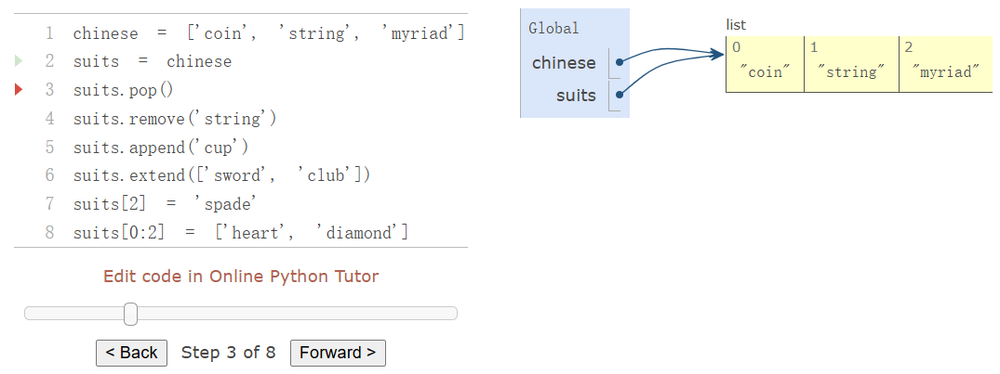


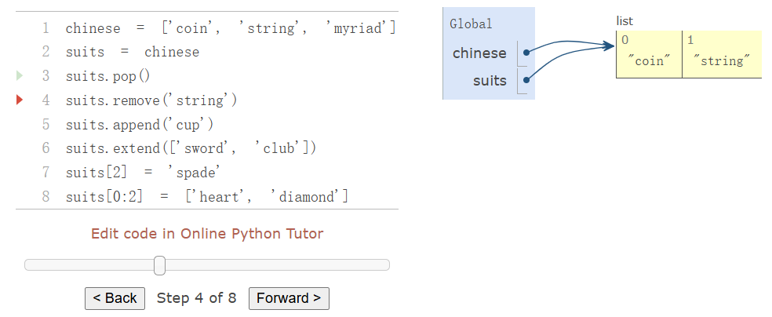


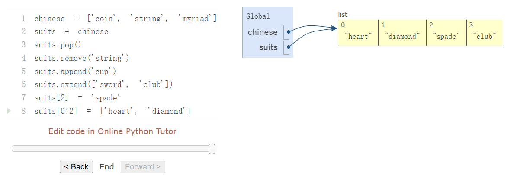

**Copy**  
lists can be copied using `list` constructor function. Changes to one lists do not affect another.

```python
nest = list(suits) # Bind "nest" to a second list with the same elements
nest[0] = suits # Create a nested list
```

In this situation, changing the list referenced by `suits` will affect the nseted list that is the first element of `nest`, but not the other elements.

```python
suits.insert(2, 'Jocker') # Insert an element at index 2, shifting the rest
nest
[['heart', 'diamond', 'Joker', 'spade', 'club'], 'diamond', 'spade', 'club']
```

**test whether two Objects are the same**  
`is` and `is not`, test whether two expressions in fact evaluate to the identical object.

```python
>>> suits is nest[0]
True
>>> suits is ['heart', 'diamond', 'spade', 'club']
False
>>> suits == ['heart', 'diamond', 'spade', 'club']
True
```

**List comprehensions**  
List comprehension always creates a new list. `unicodedata` moudule tracks the official names of every character in the Unicode alphabet.

```python
>>> from unicodedata import lookup
>>> [lookup('WHITE ' + s.upper() + ' SUIT') for s in suits]
['♡', '♢', '♤', '♧']
```

**Tuple**  
Built in `tuple` type, is an immutable sequence.  
While it is not possible to change which elements are in a tuple, it is possible to change the value of a mutable element contained within a tuple.

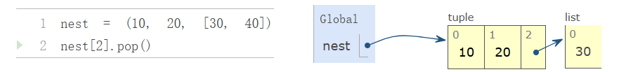

也就是说tuple实际上存贮了一个指向对象的指针，不能对tuple存储的指针进行操作，但如果这个指针指向可变数据的话，可以对这个可变数据进行操作。操作后的变化会自然而然反映在tuple上。

**Dictionaries**  
Contain key-value pairs, both keys and values are objects. Provide an abstraction for storing and retrieving values that are indexed not by consecutive integers, but by descriptive keys.

```python
>>>numerals = {'I': 1.0, 'V': 5, 'X': 10}
>>>numerals['X']
10
```

A dictionary can have at most one value for each key. Adding new key-value pairs and changing the exsiting value gor a key can both be achieved with assignment statements.

```python
>>>numerals['I'] = 1
>>>numerals['L'] = 1
>>>numerals
{'I': 1, 'X': 10, 'L': 50, 'V': 5}
```

Dictionaries are unodered collections of key-value pairs.

Dictionary type also supports various methods of iterating over the contents of the dictionary as a whole. `keys`, `values`, `items` all return iterable values.

```python
>>>sum(numerals.values())
66
```

A list of key-value pairs can be converted into dictionary by calling the `dict` constructor function

```python
>>> dict([(3, 9), (4, 16), (5, 25)])
{3: 9, 4: 16, 5: 25}
```

Restrictions:

1. key of dictionary cannot be or contain a mutable value
2. can be at most one value for a given key

**get()** returns either the value for a key, if the key is present, or a default value.

```python
>>>numerals.get('A', 0)
0
>>>numerals.get('V', 0)
5
```

**Dictionary comprehension**  
A key expression and a value expression are separated by a colon

```python
>>> {x: x*x for x in range(3, 6)}
{3: 9, 4: 16, 5: 25}
```

### 2.4.4 Local State

**local state** are changing values that have some particular contents at any point in the execution of a program.

Functions can also have local state.

```python
>>> withdraw(25)
75
>>> withdraw(25)
50
>>> withdraw(60)
'Insufficient funds'
>>> withdraw(15)
35
```

`withdraw()` must be created with an initial account balance. `make_withdraw()`, a higher-order function, takes a starting balace as an argument to create `withdraw()`

```python
def make_withdraw(balance):
    def withdraw(amount):
        nonlocal balance
        if amount > balance:
            return 'insufficient funds'
        balance = balance - amount
        return balance
    return withdraw
```

The `nonlocal` statement declares that whenever we change the binding of the name `balance`, the binding is changed in the first frame in which `balance` is already bound.  
将balance声明为nonlocal之后，每当nonlocal的值发生变化，都会向之前的帧进行查找，所有的变化都会更新到`balance`第一次被声明的位置。在这个情况下，`balance`第一次在`make_withdraw()`的参数的位置被声明。所以在`withdraw()`函数中balance的变化会同步更新到`make_withdraw()`中的`balance`

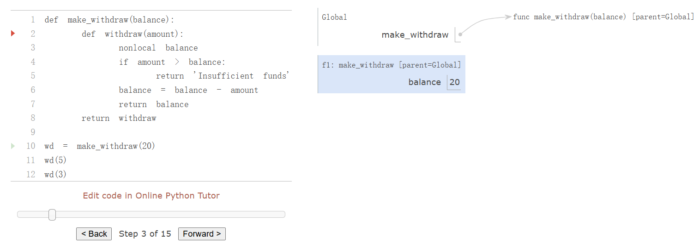


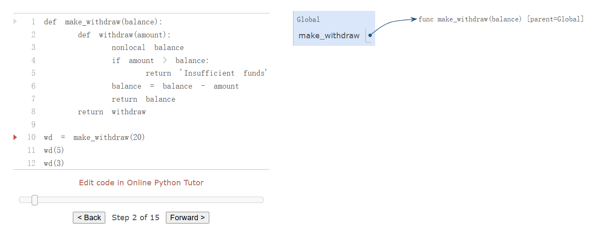

首先在global中运行`make_withdraw()`函数，进入其frame

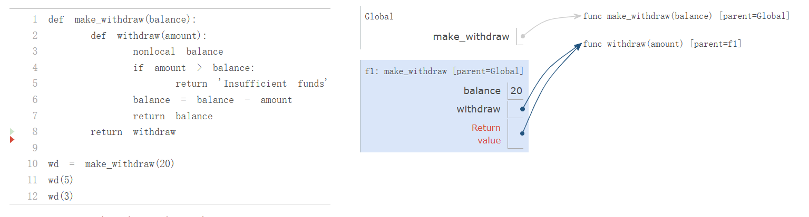

在frame中声明`balance`，并将其bind到20. 接着将`withdraw`和`return value`bind到函数object上。

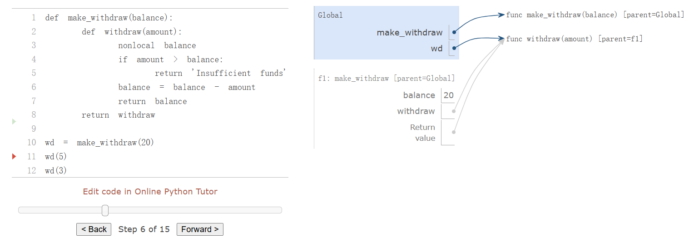

返回Global的frame中，接着将`wd` bind 到返回值所指的object上

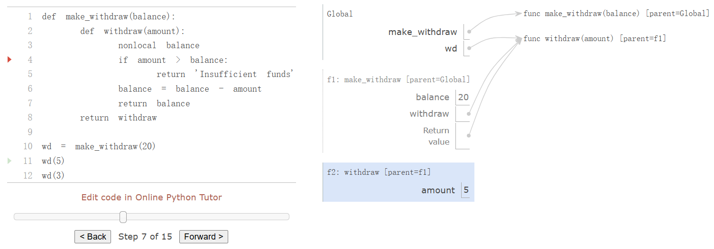

进入到f1，之后进入f2的frame中

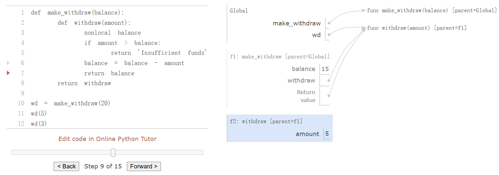

这里对balance的更改也会影响到`make_withdraw()`中的`balance`

python中赋值时隐式声明变量，无需单独操作。对于赋值时如果object是不可变类型，赋值操作会创建一个新的对象，并将变量名重新绑定到这个新的对象。 如果是可变类型，则会直接修改原对象。  
使用nonlocal来声明一个变量的时候，python会从当前函数的外层作用域开始，向上逐层查找哪个作用域中已经定义了`balance`，当找到一个作用域中已经绑定了`balance`，这个作用于就是first frame。这个frame中的`balance`的绑定会被改变。也就是说nonlocal声明的变量，视作向上逐frame查找，找到的含有这个变量的第一个frame中的变量。

```python
def make_withdraw(balance):
    def withdraw(amount):
        if amount > balance:
            return 'Insufficient funds'
        balance = balance - amount
        return balance
    return withdraw

wd = make_withdraw(20)
wd(5)
```

这个函数报错的原因是因为存在`balance = balance - amount`这行代码，python会在执行代码之前根据代码结构来确定一个变量是否为局部变量。在函数编译阶段完成。  
如果去掉这行代码

```python
def make_withdraw(balance):
    def withdraw(amount):
        if amount > balance:
            return 'Insufficient funds'
        return balance
    return withdraw

wd = make_withdraw(20)
wd(5)
```

这样就不会报错

python has an unusual restriction regarding the lookup of names: within the body of a function, all instances of a name must refer to the same frame(多次出现的同一个变量名必须指向同一个frame). As a result, Python cannot look up the value of a name in a non-local frame, then bind that same name in the local frame, because the same name would be accessed in two different frames in the same function. This restriction allows Python to precompute which frame contains each name before executing the body of a function. When this restriction is violated, a confusing error message results.

This `UnboundLocalError` appears because `balance` is assigned locally in line 5, and so Python assumes that all references to `balance` must appear in the local frame as well. This error occurs before line 5 is ever executed, implying that Python has considered line 5 in some way before executing line 3. As we study interpreter design, we will see that pre-computing facts about a function body before executing it is quite common. In this case, Python's pre-processing restricted the frame in which `balance` could appear, and thus prevented the name from being found. Adding a `nonlocal` statement corrects this error. The `nonlocal` statement did not exist in Python 2.

```python
def make_withdraw(balance):
    def withdraw(amount):
        nonlocal balance
        if amount > balance:
            return 'Insufficient funds'
        balance = balance - amount
        return balance
    return withdraw

wd = make_withdraw(20)
wd(5)
```

这样就不会报错，表明balance存在于上一个frame。

### 2.4.5 The Benefits of Non-Local Assignment

Only `wd` is associated with the frame for `make_withdraw` in which it was defined. If `make_withdraw` is called again, then it will create a seperate frame with a seperate binding for `balance`. A second call to `make_withdraw` returns a second `withdraw` function that has a different parent.

### 2.4.6 The Cost of Non-Local Assignment

When two names `wd` and `wd2` are both bound to a `withdraw` function, it does matter whether they are bound to the same function or different instance of that function.

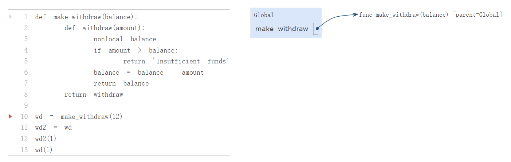

In this case, calling the function named by `wd2` changed the value of the function named by `wd`, because both names refer to the same function.

Only function calls can introduce new frames. Assignment statements always change bindings in existing frames. In this case, unless `make_withdraw` is called twice, there can be only one binding for `balance`

纯函数是**不依赖于或改变非局部环境**的函数

- 函数的输出完全由输入决定，且函数调用不会产生改变其他函数，或者环境的副作用
- 如果一个表达式只包含纯函数，它是**引用透明**的，即

  - 如果用一个子表达式的值替换它本身，表达式的值不会发生变化
  - `2+3`始终等于`5`。用`5`替换`2+3`并不会改变程序  
    引入非纯函数会破坏这种透明性


### 2.4.7 Implementing Lists and Dictionaries

Represent mutable list using functions with local state.  
Represent a mutable linked list by function that has a linked as its local state.

The function is a dispatch function and its arguments are first a message, followed by additional arguments to parameterize that method. This message determines the behavior of the function, and the additional arguments are used in that behavior.

Mutuable list will respond to five different message: `len`, `getitem`, `pop_first`, and `str`.

```python
def mutable_link():
    '''return a functional implementation of a mutable linked list.'''
    contents = empty
    def dispatch(message, value=None):
        nonlocal contents
        if message == 'len':
            return len_link(contents)
        elif message == 'getitem':
            return getitem_link(contents, value)
        elif message == 'push_first':
            contents = link(value, contents)
        elif message == 'pop_first':
            f = first(contents)
            contents = rest(contents)
            return f
        elif message == 'str':
            return join_link(contents, ',')
    return dispatch
```

Construct a functionally implemented linked list by adding each element in reverse order.

```python
def to_mutable_link(source):
    '''返回一个与源列表相同内容的函数列表'''
    s = mutable_link()
    for element in reversed(source):
        s('push_first', element)
    return s
```

Construct a functionally implemented mutable linked lists.

```python
>>> s = to_mutable_link(suits)
>>> type(s)
<class 'function'>
>>> print(s('str'))
heart, diamond, spade, club
```

**Implementing Dictionaries**

```python
def dictionary():
    
    records = []
    def getitem(key):
        matches = [r for r in records if r[0] == key]
        if len(matches) == 1:
            key, value = matches[0]
            return value
    def setitem(key, value):
        nonlocal records
        non_matches = [r for r in records if r[0] != key]
        records = non_matches + [[key, value]]
    def dispatch(message, key=None, value=None):
        if message == 'getitem':
            return getitem(key)
        elif message == 'setitem':
            setitem(key, value)
    return dispatch
```

```python
my_dict = dictionary()
my_dict('setitem', key='LIU', value=23)
my_dict('setitem', key='WANG', value=21)
>>>my_dict('getitem', key='LIU')
23
```

### Dispatch Dictionaries

look up a message using dictionaries.

```python
def account(initial_balance):
    def deposit(amount):
        dispatch['balance'] += amount
        return dispatch['balance']
    def withdraw(amount):
        if amount > dispatch['balance']:
            return 'Insufficient funds'
        dispatch['balance'] -= amount
        return dispatch['balance']
    dispatch = {'deposit': deposit,
                'withdraw': withdraw,
                'balance': initial_balance
                }
    return dispatch
```

```python
def withdraw(account, amount):
    return account['withdraw'](amount)
def deposit(account, amount):
    return account['deposit'](amount)
def check_balance(account):
    return account['balance']
```

```python
a = account(20)
deposit(a, 5)
withdraw(a, 17)
check_balance(a)
```

### 2.4.9 Propagating Constraints

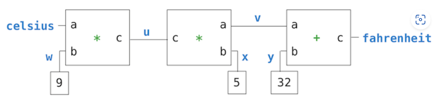

Constraint System between `Celsius` and `Fahrenheit`  
The constrain between `c` and `f` can be thought of as  a network consisting of primitive `adder`, `multiplier` and `constant` constrains.

**Processing Flow**: when a connector is given a value, it awakens all of its associated constrains (expect for the constrain that just awakened it) to inform them taht it has a value. Then each awakened constraint box polls its connectors to see if there is enough information to determine a value for a connector. If so, the box sets that connector, which then awakens all of its associated constrains, and so on.

- **Connectors** are dictionaries that hold a current value and respond to messages that manipulate that value.
- **Constraints** are dictionaries that do not hold local states themselves. Their responses to messages are **non-pure functions** that change the connectors that they constrain.  
  为什么这个返回值是一个非纯函数，这意味着变量是和函数同级在系统的frame中的吗，还是变量存在于connector中呢。

e.g  
send a **message** to connector to set its value.

```python
>>> celsius['set_val']('user', 25)
Celsius = 25
Fahrenheit = 77.0
```

celsius是一个connector，其中包含了一个dispatch dictionary。`'set_val'`对应的value是一个函数？ 那么constraint的返回值到底是什么？

```python
>>> fahrenheit['set_val']('user', 212)
Contradiction detected: 77.0 vs 212
```

tell `celsius` to forget its old value to reuse the network with new values.

```python
>>> celsius['forget']('user')
Celsius is forgotten
Fahrenheit is forgotten
```

**Implementing the Constraint System**  
**Connector**  
dictionaries that map message names to function and data values.

- `connector['set_val'](source, value)` indicates that the `source` is requesting the connector to set its current value to `value`
- `connector['has_val']()` returns whether the connector already has a value.
- `connecotr['val']` is the current value of the connector
- `connector['forget'](source)` tells the connector that the `source` is requesting it to forget its value.
- `connector['connect'](source)` tells the connector to participate in a new constraint, the `source`

**Constraint**  
dictionaries, which receive information from connectors by means of two message

- `constraint['new_val']()` indicates that some connector that is connected to the constraint has a new value.
- `constraint['forget']()` indicates that some connector that is connected to the constraint has forgotten its value.

`adder` function:  
to support multidirectional constraint propagation, the adder must also specify that it subtracts `a` from `c` to get `b` and likewise subtracts `b` from `c` to get `a`

```python
>>> from operator import add, sub
>>> def adder(a, b, c):
        return make_ternary_constraint(a, b, c, add, sub, sub)
```

The implementation of a generic tenary(three-way) constraint, which uses the three connectors and three functions from `adder` to create a constraint that accepts `new_val` and `forget` messages. The response to messages are local functions, which are placed in a dictionary called `constraint`

```python
def make_ternary_constarint(a, b, c, ab, ca, cb):
    '''The constraint that ab(a, b)=c and ca(c, a)=b and cb(c, b)=a'''
    def new_value():
        av, bv, cv = [connector['has_val']() for  connector in (a, b, c)]
        if av and bv:
            c['set_val'](constraint, ab(a['val'], b['val']))
        elif av and cv:
            b['set_val'](constraint, ca(c['val'], a['val']))
        elif bv and cv:
            a['set_val'](constraint, cb(c['val'], b['val']))
    
    def forget_value():
        for connector in (a, b, c):
            connector['forget'](constraint)
    
    constraint = {'new_val': new_value, 'forget': forget_value}
    for connector in (a, b, c):
        connector['connect'](constraint)
    return constraint

def adder(a, b, c):
    '''The constraint that a + b = c'''
    return make_ternary_constarint(a, b, c, add, sub, sub)
```

the dictionary called `constraint` is a dispatch dictionary. It responds to the two messages that constraints receive, is also passed as the `source` argument in calls to its connectors.

The constraint's local function `new_value` is called whenever the constraint is informed that one of its connectors has a value. If the constraint is informed that one of its connectors has forgotten its value, it requests that all of its connectors now forget their values.

**Representing connectors** A connector is represented as a dictionary that contains a value, but also has response functions with local state. the connector must track the `informant` that gave it its current value, and a list of `constraints` in which it participates.

```python
    '''A connector between constraints'''
    informant = None
    constraints = []
    
    def set_value(source, value):
        nonlocal informant
        val = connector['val']
        if val is None:
            informant, connector['val'] = source, value
            if name is not None:
                print(name, '=', value)
            inform_all_expect(source, 'new_val', constraints)
        else:
            if val != value:
                print('Constradiction detected:', val, 'vs', value)
    
    def forget_value(source):
        nonlocal informant
        if informant == source:
            informant, connector['val'] = None, None
            if name is not None:
                print(name, 'is forgotten')
            inform_all_expect(source, 'forget', constraints)
    
    connector = {'val':  None,
                 'set_val':  set_value,
                 'forget':  forget_value,
                 'has_val': lambda: connector['val'] is not None,
                 'connect': lambda source: constraints.append(source)
                 }
    return connector
```

注意到整个connector包含一个调度字典connector，其中包含了一个值和4种方法，设置，遗忘，检查是否有值，连接到一个constraint上。  
还有一个三个值，name用来记录connector的名字，informant用来记录消息的来源，constraints用来记录连接的constraint

整理：

1. **connector**： have a dispatch dictionary(connector) and a list used to record the constraints connecting to and a string informant to save the source of the message.  
   When `set_value` or `forget_value` is called, the connector will process as they are telled, then inform the constraints connecting to the change. And so on.
2. **make_ternary_constraint(a, b, c, ab, ca, cb)**: have a dispatch dictionary and two functions with local state(the connector connecting to). When get `new_val` the `new_value()` will be called, When get `forget` the `forget_value()` will be called. The connector connecting to will be add when construct a constraint.
3. **constant(connector, value)**: 只有一个操作，就是在创建的时候将connector的值设置为value，这样每次激活constant这个条件的时候，就会检查一遍相应connector的值来确保条件成立。
4. **converter(c, f)**: assembles the various connectors and constraints in the network. 首先统一创建除了输入输出所有参数的connector。之后用条件进行约束。
5. **adder(a, b, c)**: 通过`make_ternary_constraint(a, b, c, add, sub, sub, sub)`创建的约束，是一个字典
6. **multiplier(a, b, c)**: 通过`make_ternary_constraint(a, b, c, add, sub, sub, sub)`创建的约束，是一个字典

```python
def multiplier(a, b, c):
    '''The constraint that a * b = c'''
    return make_ternary_constarint(a, b, c, mul, truediv, truediv)
def adder(a, b, c):
    '''The constraint that a + b = c'''
    return make_ternary_constarint(a, b, c, add, sub, sub)
def constant(connector, value):
    '''The constraint that connector = value'''
    constraint = {}
    connector['set_val'](constraint, value)
    return constraint
def inform_all_except(source, message, constraints):
    '''inform all constraints of the message, expect source'''
    for c in constraints:
        if c != source:
            c[message]()
def connector(name=None):
    '''A connector between constraints'''
    informant = None
    constraints = []
    
    def set_value(source, value):
        nonlocal informant
        val = connector['val']
        if val is None:
            informant, connector['val'] = source, value
            if name is not None:
                print(name, '=', value)
            inform_all_except(source, 'new_val', constraints)
        else:
            if val != value:
                print('Constradiction detected:', val, 'vs', value)
    
    def forget_value(source):
        nonlocal informant
        if informant == source:
            informant, connector['val'] = None, None
            if name is not None:
                print(name, 'is forgotten')
            inform_all_except(source, 'forget', constraints)
    
    connector = {'val':  None,
                 'set_val':  set_value,
                 'forget':  forget_value,
                 'has_val': lambda: connector['val'] is not None,
                 'connect': lambda source: constraints.append(source)
                 }
    return connector
    
celsius = connector('Celsius')
fahrenheit = connector('Fahrenheit')

def convert(c, f):
    u, v, w, x, y = [connector() for _ in range(5)]
    multiplier(c, w, u)
    multiplier(v, x, u)
    adder(v, y, f)
    constant(w, 9)
    constant(x, 5)
    constant(y, 32)
    
convert(celsius, fahrenheit)
```

```python
>>> celsius['set_val']('user', 25)
```

```bash
Celsius = 25
Fahrenheit = 77.0
```

由于convert函数在运行的时候，约束条件会存储在celsius和fahrenheit下面，因此不会被销毁。而其他的constraint会存储multiplier，因此也不会被销毁。这样就完成了一个约束系统。

## 2.3 Sequence

### 2.3.6 Trees

```python
def tree(root_label, branches = []):
    for branch in branches:
        assert is_tree(branch), 'branches must be trees'
    return [root_label] + list(branches)

def label(tree):
    return tree[0]

def branches(tree):
    return tree[1:]

def is_tree(tree):
    if type(tree) != list or len(tree) < 1:
        return False
    for branch in branches(tree):
        if not is_tree(branch):
            return False
    return True
    
def is_leaf(tree):
    return not branches(tree)
```

A tree is a object only containing list object.  A tree is a recursive object which means the except the root of the tree, other elements in the tree are also tree objectives. 通过 `is_tree()` 可以看出，tree是一个长度大于等于一的list，构成可以为一个包含单个值的list或者包含一个值和其他树的list。


**Fibonacci tree**

```python
def fib_tree(n):
    if n == 0 or n == 1:
        return tree(n)
    else:
        left, right = fib_tree(n - 2), fib_tree(n - 1)
        fib_n = label(left) + label(right)
        return tree(fib_n, [left, right])
```

如果`n==0` 或者 `n==1`直接返回一个 `label`为 `n`的 `tree` 如果不是，则将生成两个`tree`,`n-2`和 `n-1`之后将两个`tree`作为branches，label作为两个tree的label相加，返回这个tree。

**Count leaves**

```python
def count_leaves(tree):
    if is_leaf(tree):
        return 1
    else:
        branch_counts = [count_leaves(b) for b in branches(tree)]
        return sum(branch_counts)
```

如果这个树没有branches就返回1，其余情况返回所有branches的leaves之和

**Partition trees**

A partition tree for `n` using parts up to size `m` is a binary tree that represents the choices taken during computation.

```python
def partition_tree(n, m):
    if n == 0:
        return tree(True)
    elif n < 0 or m == 0:
        return tree(False)
    else:
        left = partition_tree(n - m, m)
        right = partition_tree(n, m - 1)
        return tree(m, [left, right])
```

print the partitions

```python
def print_parts(tree, partition = []):
    if is_leaf(tree):
        if label(tree):
            print('+'.join(partition))
        else:
            left, right = branches(tree)
            m = str(label(tree))
            print_parts(left, partition + [m])
            print_parts(right, partition)
```

这个函数妙在使用`paitition + [m]`返回了一个新的list对象，而不是在原有的partition上进行更改。巧妙地避免了所有的分支都对一个partition进行修改的问题。

`right_binarize()`

```python
def right_binarize(tree):
    if is_leaf(tree):
        return tree
    if len(tree) == 2:
        return tree
    if len(tree) > 2:
        return [label(tree), right_binarize(tree[1:])]
```

**Linked List**

Represent List using nested pairs.

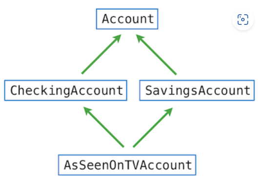

Advantages:

1. do not restricted to continuous space
2. can add items easily because of reason 1

**Recursive manipulation**

```python
empty = 'empty'

def is_link(s):
    return s == empty or (len(s) == 2 and is_link(s[1]))

def link(first, rest):
    assert is_link(rest), 'rest must be a linked list'
    return [first, rest]

def first(s):
    assert is_link(s), 'first only applies to linked lists'
    assert s != empty, 'empty linked list has no first element'
    return s[0]

def rest(s):
    assert is_link(s), 'rest only applies to linked lists'
    assert s != empty, 'empty linked list has no rest'
    return s[1]
```


## 2.5 Object-Oriented Programming

```python
class Account:
    def __init__(self, account_holder):
        self.balance = 0
        self.holder = account_holder
```

`self` is bound to the newly created `Account` object. `account_holder` is bound to the argument passed to the class when it is called to be instantiated.


Each method definition includes a special first parameter `self`, which is bound to the objecton which the method is invoked.

When a method is invoked via dot notation, the object itself plays a dual role.

1. determines what the name `withdraw` means; `withdraw` is not a name in the environment, but instead a name that is local to the `Account` class.
2. It is bound to the first parameter `self` when the `withdraw` method is invoked.

### 2.5.4 Class Attibutes(class variable or static variable)

Attributes are associated with the class itself, rather than any individual instance of the class.

Class attributes are created by assignment statement in the suite of a `class` statement, outside of method definition.

```python
>>> class Account:
        interest = 0.02            # A class attribute
        def __init__(self, account_holder):
            self.balance = 0
            self.holder = account_holder
        # Additional methods would be defined here
```

The attribute can be accessed from any instance of the class

```python
>>> spock_account = Account('Spock')
>>> kirk_account = Account('Kirk')
>>> spock_account.interest
0.02
>>> kirk_account.interest
0.02
```

A singgle assignment statement to a class attribute changes the value of the attribute for all instances of the class

```python
>>> Account.interest = 0.04
>>> spock_account.interest
0.04
>>> kirk_account.interest
0.04
```

**Attribute names**

```python
<expression>.<name>
```

To evaluate a dot expression:

1. Evaluate the <expression> to the left of the dot, which yields the *object* of the dot expression.
2. <name> is matched against the instance attributes of that object; if an attribute with that name exists, its value is returned.
3. If <name> does not appear among instance attributes, then <name> is looked up in the class, which yields a class attribute value.
4. That value is returned unless it is a function, in which case a bound method is returned instead.

**Attribute assignment**

If the object is an instance, the assignment sets an instance attribute. If the object is a class, then assignment sets a class attribute.

```python
>>> kirk_account.interest = 0.08
```

This will create a new instance attribute that has the same name as the exsting class attribute.

```python
>>> kirk_account.interest
0.08
```

The class attribute `interest` retains its original value

```python
>>> spock_account.interest
0.04
```

changes to the class attribute `interest` will affect `spock_account`, but the instance attribute for `kirk_account` will be unaffected

```python
>>> Account.interest = 0.05  # changing the class attribute
>>> spock_account.interest     # changes instances without like-named instance attributes
0.05
>>> kirk_account.interest     # but the existing instance attribute is unaffected
0.08
```


**Dot expression**

```python
<expression>.<name>
```

The `<expression>` can be any valid Python expression, but the `<name>` must be a simple name (not an expression that evaluates to a name).

But we can look up an attribute using expression with `getattr`

```python
getattr(account1, `balance`)
```

`getattr` is equivalent of dot notation.


**Methods and functions**

Python distinguishes between ***functions***     and ***bound method***     . A bound method value is already associated with its first argument

As an attribute of a class, a method is just a function, but as an attribute of an instance, it is a bound mehtod.

```python
>>> type(Account.deposit)
<class 'function'>
>>> type(account1.deposit)
<class 'method'>
```

The first is a standard two-argument function with parameters `self` and `amount`, the second is a one-argument method, where `self` will be bound to object that named `account1` automatically. Both of these values, whether function values or bound method values, are associated with the same `deposit` function body.

We can call `deposit` in two ways

```python
>>> Account.deposit(account1, 1001)
1001
>>> account1.deposit(1000)
2011
```

The function getattr behaves exactly like dot notation: if its first argument is an object but the name is a method defined in the class, then getattr returns a bound method value. On the other hand, if the first argument is a class, then getattr returns the attribute value directly, which is a plain function.


There are instance variables and methods that are related to the maintenance and consistency of an object that we don't want user of the object to see or use. They are not part of the abstraction defined by a class, but instead part of the implementation. The name of the method should only be accessed within methods of the class itself should starts within an underscore.


## 2.5.5 Inheritance

```python
>>> class Account:
        """A bank account that has a non-negative balance."""
        interest = 0.02
        def __init__(self, account_holder):
            self.balance = 0
            self.holder = account_holder
        def deposit(self, amount):
            """Increase the account balance by amount and return the new balance."""
            self.balance = self.balance + amount
            return self.balance
        def withdraw(self, amount):
            """Decrease the account balance by amount and return the new balance."""
            if amount > self.balance:
                return 'Insufficient funds'
            self.balance = self.balance - amount
            return self.balance
```

Python can add some attributes to an instance after construction

```python
account1 = Account('P1')
account2 = Account('P2')
account1.interest = 0.1
account1.att = 'att1'

print(account1.interest, account2.interest)
print(account1.att)

0.1 0.02
att1
```

inheritance by placing an expression that evaluates to the base class in parentheses after the class name

```python
>>> class CheckingAccount(Account):
        """A bank account that charges for withdrawals."""
        withdraw_charge = 1
        interest = 0.01
        def withdraw(self, amount):
            return Account.withdraw(self, amount + self.withdraw_charge)
```

```python
>>> checking = CheckingAccount('Sam')
>>> checking.deposit(10)
10
>>> checking.withdraw(5)
4
>>> checking.interest
0.01
```

`checking.deposit` evaluates to a bound method, which was defined in the `Account` class.

When Python resolves a name in dot expression that is not an attribute of the instance, it lokks up the name in the class. To look up a name in a class:

1. if it names an attribute in the class, return the attribute value.
2. Otherwise, look up the name in the base class, if there is one

在 `deposit` 的例子中，Python 首先会在实例上查找名称，然后在 `CheckingAccount` 类中查找，最后在 `Account` 类中查找到 `deposit` 的定义。根据点表达式的求值规则，由于 `deposit` 是一个在类中查找到的函数，对于 `checking` 实例来说，该点表达式求值为一个绑定方法（bound method）。该方法接收参数 `10`，会调用 `deposit` 方法，并将 `self` 绑定到 `checking` 对象，将 `amount` 绑定到 `10`。

类中定义的函数并不属于实例instance，而是属于类本身class。当通过实例instance调用的时候，由于instance中并无此attribute，所以会向class中逐层查找。找到后，调用类中的方法，并将对象本身绑定到类方法的self上。

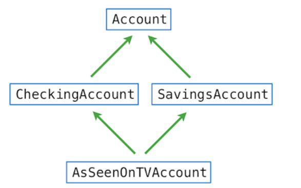

Each arrow points from a subclass to a base class.

Python resolves names from left to right, then upwards. In this example, Python checks for an attribute name in the following classes, in order, until an attribute with that name is found:

AsSeenOnTVAccount, CheckingAccount, SavingsAccount, Account, object

## 2.5.7 Multiple Inheritance

```python
class SavingsAccount(Account):
        deposit_charge = 2
        def deposit(self, amount):
            return Account.deposit(self, amount - self.deposit_charge)
            
class AsSeenOnTVAccount(CheckingAccount, SavingsAccount):
        def __init__(self, account_holder):
            self.holder = account_holder
            self.balance = 1           # A free dollar!
            
>>> such_a_deal = AsSeenOnTVAccount("John")
>>> such_a_deal.balance
1
>>> such_a_deal.deposit(20)            # $2 fee from SavingsAccount.deposit
19
>>> such_a_deal.withdraw(5)            # $1 fee from CheckingAccount.withdraw
13
```

When the reference is ambiguous, such as the reference to the `withdraw` method is defined in both `Account` and `CheckingAccount`.


## 2.7 Object Abstraction

**Generic function**

Three different techniques for implementing generic functions:

1. shared interfaces
2. type dispatching
3. type coercion

### 2.7.1 String Conversion

Python stipulates that all objects should produce two different string representations

1. Human-interpretable text
2. Python-interpretable expression

The constructor function for strings, `str`, returns a human-readable string. The `repr` function returns a Python expression that evaluates to an equal object.

```python
repr(object) -> string

Return the canonical string representation of the object.
For most object types, eval(repr(object)) == object
```

Every object is an instance of some particular class.

The result of calling `repr` on the value of an expression is what Python prints in an interactive session.

```python
>>> 12e12
12000000000000.0
>>> print(repr(12e12))
12000000000000.0
```

In cases where no representation exists that evaluates to the original value, Python typically produces a description surrounded by angled brackets.

```python
>>> repr(min)
'<built-in function min>'
```

`str` constructor often coincides with `repr`, but provides a more interpretable text representation in some class.

```python
>>> from datetime import date
>>> tues = date(2011, 9, 12)
>>> repr(tues)
'datetime.date(2011, 9, 12)'
>>> str(tues)
'2011-09-12'
```

`repr` should apply correctly to all data types even those without `repr` method.  The `repr` function always invokes a method called `__repr__` on its argument.

```python
>>> tues.__repr__()
'datetime.date(2011, 9, 12)'
```

`str` constructor is implemented in a similar manner: it invokes a method called `__str__` on its argument

```py
>>> tues.__str__()
'2011-09-12'
```

Certain functions should apply to multiple data types. Moreover, one way to create such a function is to use a shared attribute name with a different definition in each class.


### 2.7.2 Special Methods

In Python, certain special names are invoked by the Python interpreter in special circumstances. The `__init__` method of a class is automatically invoked whenever an object is constructed. The `__str__` method is invoked automatically when printing, and `__repr__` is invoked in an interactive session to display values.


Special names:

1. **True and false values**

   All objects in Python have a truth value. Objects of user-defined classes are considered to be true, but the special `__bool__` method can be used to override this behavior. If an object defines the `__bool__` method, then Python calls that method to determine its truth value.

   e.g.

   account with 0 balance should be false

   ```py
   Account.__bool__ = lambda self: self.balance != 0
   ```


Call `bool` constructor to see the truth value of an object

2. **Sequence operations**

   ```py
   >>> len('Go Bears!')
   9
   ```

   `len` invokes the `__len__` method of its argument to determine its length.

   Python use a sequence's length to determine its truth value, if it does not provide a `__bool__` method. Empty sequences are false, while non-empty sequences are true.

   `__getitem__` method is invoked by the element selection operator.


```py
>>> 'Go Bears!'[3]
'B'
>>> 'Go Bears!'.__getitem__(3)
'B'
```

3. **Callable objects**

   Python allows to define objects that can be "called" like functions by including a `__call__` method.

   ```py
   >>> def make_adder(n):
           def adder(k):
               return n + k
           return adder
   >>> add_three = make_adder(3)
   >>> add_three(4)
   7
   ```

   We can also create a `add_three` using object.


```py
>>> class Adder(object):
        def __init__(self, n):
            self.n = n
        def __call__(self, k):
            return self.n + k
>>> add_three_obj = Adder(3)
>>> add_three_obj(4)
7
```

The `Adder` class behaves like the `make_adder` higher-order function, and the `add_three_obj` object behaves like the `add_three` function.

4. **Arithmetic**

   To evaluate expressions that contain the `+` operator, Python checks for special method on both the left and right operands of the expression.

   1. checks for an `__add__` method on the value of the left operand
   2. checks for an `__radd__` method on the value of the right operand

   If either is found, that method is invoked with the value of the other operand as its argument.


### 2.7.3 Multiple Representations

There might be more than one useful representation for a data object, and we might like to design systems that can deal with multiple representations(like complex number can be represented in two almost equivalent ways. We want functions works with either representatin.)

```py
>>> class Number:
        def __add__(self, other):
            return self.add(other)
        def __mul__(self, other):
            return self.mul(other)
```

This number class does not have an `__init__` method. The purpose of `Number` is not to be instantiated directly, but instead to serve as a superclass of various specific number classes.

The `Complex` class inherits from `Number` and describe arithmetic for complex numbers.

```py
>>> class Complex(Number):
        def add(self, other):
            return ComplexRI(self.real + other.real, self.imag + other.imag)
        def mul(self, other):
            magnitude = self.magnitude * other.magnitude
            return ComplexMA(magnitude, self.angle + other.angle)
```

This implementation assumes that two classes exist for complex numbers, correspond to their two natural representations:

- `ComplexRI` constructs a complex number from real and imaginary parts.
- `ComplexMA` constructs a complex number from a magnitude and angle.

**Interfaces**

Object attributes, which are a form of message passing, allows different data types to respond to the same message in different ways. An interface is a set of shared attribute names, along with a specification of their behavior. In the case of complex numbers, the interface needed to implement arithmetic consists of four attributes: `real`, `imag`, `magnitude` and `angle`

For complex arithmetic to be correct, these attributes must be consistent. The rectangular `(real, imag)` and the polar coordinates `(magnitude, angle)` must describe the same point on the complex plane. The `Complex` class implicity defines this interface by determing how these attributes are used to `add` and `mul` complex numbers.

两种不同的complex number class，但是实现了共同的接口（interface），所以两类complex number可以以不同的方式相应同一条消息。

**Properties**

The requirement that two or more attribute values maintain a fixed relationship with each other is a new problem. One solution is to store attribute values for only representation and compute the other representation whenever it is needed.

Python can compute attributes on the fly from zero-argument functions. The `@property` decorator allows functions to be called without call expression syntax (paretheses following an expression).

The `ComplexRI` class stores `real` and `imag` attributes and computes `magnitude` and `angle` on demand.

```py
>>> from math import atan2
>>> class ComplexRI(Complex):
        def __init__(self, real, imag):
            self.real = real
            self.imag = imag
        @property
        def magnitude(self):
            return (self.real ** 2 + self.imag ** 2) ** 0.5
        @property
        def angle(self):
            return atan2(self.imag, self.real)
        def __repr__(self):
            return 'ComplexRI({0:g}, {1:g})'.format(self.real, self.imag)
```

all four attributes needed for complex arithmetic can be accessed without any call expression, and change to `real` or `img` are reflected in the `magnitude` and `angle`

```py
>>> ri = ComplexRI(5, 12)
>>> ri.real
5
>>> ri.magnitude
13.0
>>> ri.real = 9
>>> ri.real
9
>>> ri.magnitude
15.0
```

The `ComplexMA` class stores `magnitude` and `angle` but computes `real` and `img` whenever those attributes are looked up

```py
>>> from math import sin, cos, pi
>>> class ComplexMA(Complex):
        def __init__(self, magnitude, angle):
            self.magnitude = magnitude
            self.angle = angle
        @property
        def real(self):
            return self.magnitude * cos(self.angle)
        @property
        def imag(self):
            return self.magnitude * sin(self.angle)
        def __repr__(self):
            return 'ComplexMA({0:g}, {1:g} * pi)'.format(self.magnitude, self.angle/pi)
```

```py
>>> ma = ComplexMA(2, pi/2)
>>> ma.imag
2.0
>>> ma.angle = pi
>>> ma.real
-2.0
```

```py
>>> from math import pi
>>> ComplexRI(1, 2) + ComplexMA(2, pi/2)
ComplexRI(1, 4)
>>> ComplexRI(0, 1) * ComplexRI(0, 1)
ComplexMA(1, 1 * pi)
```

### 2.7.4 Generic Functions

Execpt sharing interface, the generic functions can be implemented by

1. type dispatching
2. type coercion

superclass只定义了接口interface，之后任何实现了这个接口的subclass都可以进行相应的抽象运算

```py
>>> from fractions import gcd
>>> class Rational(Number):
        def __init__(self, numer, denom):
            g = gcd(numer, denom)
            self.numer = numer // g
            self.denom = denom // g
        def __repr__(self):
            return 'Rational({0}, {1})'.format(self.numer, self.denom)
        def add(self, other):
            nx, dx = self.numer, self.denom
            ny, dy = other.numer, other.denom
            return Rational(nx * dy + ny * dx, dx * dy)
        def mul(self, other):
            numer = self.numer * other.numer
            denom = self.denom * other.denom
            return Rational(numer, denom)
```

This class implemented the interface of `Number` superclass by including `add` and `mul` methods.

```py
>>> Rational(2, 5) + Rational(1, 10)
Rational(1, 2)
>>> Rational(1, 4) * Rational(2, 3)
Rational(1, 6
```

**Type dispatching**

One way to implement cross-type operations is to select behavior based on the types of the arguments to a function or method.

The built-in function `isinstance` takes an object and a class, returns true if the object has a class that either is or inherits from the given class

```py
>>> c = ComplexRI(1, 1)
>>> isinstance(c, ComplexRI)
True
>>> isinstance(c, Complex)
True
>>> isinstance(c, ComplexMA)
False
```

e.g.

```py
>>> def is_real(c):
        """Return whether c is a real number with no imaginary part."""
        if isinstance(c, ComplexRI):
            return c.imag == 0
        elif isinstance(c, ComplexMA):
            return c.angle % pi == 0
>>> is_real(ComplexRI(1, 1))
False
>>> is_real(ComplexMA(2, pi))
True
```

we can also use `type_tag` to perform type dispatching

Combine complex and rational numbers

```py
>>> def add_complex_and_rational(c, r):
        return ComplexRI(c.real + r.numer/r.denom, c.imag)
```

```py
>>> def mul_complex_and_rational(c, r):
        r_magnitude, r_angle = r.numer/r.denom, 0
        if r_magnitude < 0:
            r_magnitude, r_angle = -r_magnitude, pi
        return ComplexMA(c.magnitude * r_magnitude, c.angle + r_angle)
```

```py
>>> def add_rational_and_complex(r, c):
        return add_complex_and_rational(c, r)
>>> def mul_rational_and_complex(r, c):
        return mul_complex_and_rational(c, r)
```

So the interface of `Number` can be writted as:

1. if two arguments have the same type tag, then it assumes that `add` method of the first can take the second as argument.
2. Otherwise, it checks whether a dictionary of cross-type implementations, called `adder`

   contains a function that can add argument of those type tags. If there is such a fucntion, the `cross_apply` method finds and applies it.


```py
>>> class Number:
        def __add__(self, other):
            if self.type_tag == other.type_tag:
                return self.add(other)
            elif (self.type_tag, other.type_tag) in self.adders:
                return self.cross_apply(other, self.adders)
        def __mul__(self, other):
            if self.type_tag == other.type_tag:
                return self.mul(other)
            elif (self.type_tag, other.type_tag) in self.multipliers:
                return self.cross_apply(other, self.multipliers)
        def cross_apply(self, other, cross_fns):
            cross_fn = cross_fns[(self.type_tag, other.type_tag)]
            return cross_fn(self, other)
        adders = {("com", "rat"): add_complex_and_rational,
                  ("rat", "com"): add_rational_and_complex}
        multipliers = {("com", "rat"): mul_complex_and_rational,
                       ("rat", "com"): mul_rational_and_complex}
```

**Coercion**

The different data types are not completely independent, and there may be ways by which objects of one type may be viewed as being of another type(coercion).

define a coercion function, which transforms a rational number to a complex number with zero imaginary part

```py
>>> def rational_to_complex(r):
        return ComplexRI(r.numer/r.denom, 0)
```

```py
>>> class Number:
        def __add__(self, other):
            x, y = self.coerce(other)
            return x.add(y)
        def __mul__(self, other):
            x, y = self.coerce(other)
            return x.mul(y)
        def coerce(self, other):
            if self.type_tag == other.type_tag:
                return self, other
            elif (self.type_tag, other.type_tag) in self.coercions:
                return (self.coerce_to(other.type_tag), other)
            elif (other.type_tag, self.type_tag) in self.coercions:
                return (self, other.coerce_to(self.type_tag))
        def coerce_to(self, other_tag):
            coercion_fn = self.coercions[(self.type_tag, other_tag)]
            return coercion_fn(self)
        coercions = {('rat', 'com'): rational_to_complex}
```


# Chapter 4

## 4.2 Implicit Sequence

A sequence can be represented without each element being stored explicityly in the memory of the computer. Construct object that provides access to all of the elements of some sequential dataset without computing the value of each element in advance. Compute elements on demand.

When an element is requested from a `range`, the element is computed without conputing in advance. Only the end point of the range are stored as part of the `range` object.

### 4.2.1 Iterators

**Iterator**: an object provides sequential access to values, one by one.  
two components:

- mechanism for retrieving the **next element** in the sequence
- a mechanism for **signal that the end** of the sequence has been reached and no further elements remain.

a iterator can be obtained by calling the built-in `iter` function, the contents of the iterator can be accessed by calling the built-in `next` function

```python
>>> primes = [2, 3, 5, 7]
>>> type(primes)
>>> iterator = iter(primes)
>>> type(iterator)
>>> next(iterator)
2
>>> next(iterator)
3
>>> next(iterator)
5
```

Python signals that there is no more values avaiable by raising a `StopIteration` exception when `next` is called. This expection can be handled using a `try` statement.

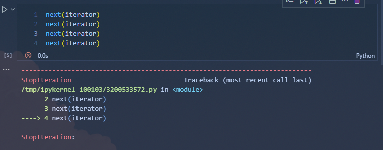

An iterator maintains local state to represent its position in a sequence. Each time `next` is called, that position advances. Two separate iterators can track two different positions in the same sequence. Two names for the same iterator will share a position.

Calling `iter` on an iterator will return that iterator, **not a copy**. 相当于原本iterator的别名。

### 4.2.2 Iterables

An iterable value is anything that can be passed to the built-in `iter` function.(including `strings`, `tuples`, `sets`, `dictionaries`, `iterators`)

字典也可以迭代， 顺序是键值对加入字典时的顺序。如果字典由于添加或者删除键导致其结构改变，则所有迭代器都会失效。更改键值不会更改内容的顺序或者使迭代器无效。

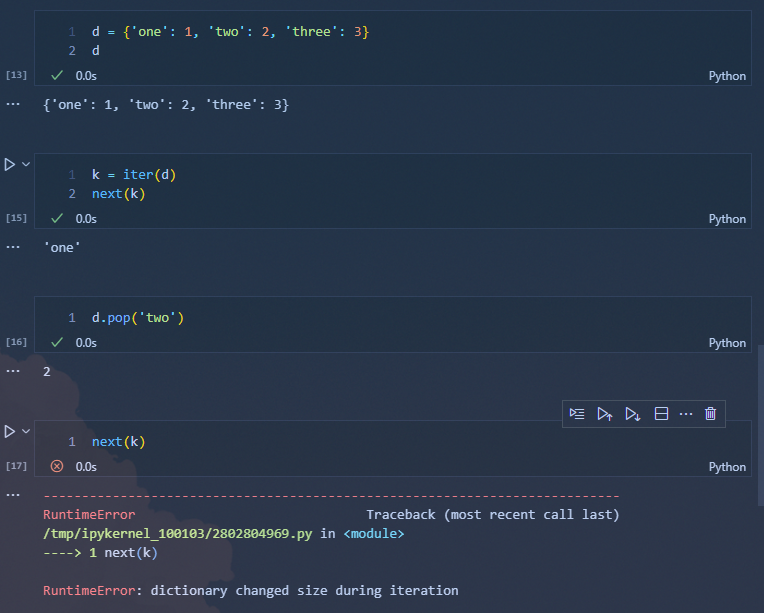

### Built-in Iterators

Several built-in functions take as arguments iterable values and return iterators.  
`map` function:

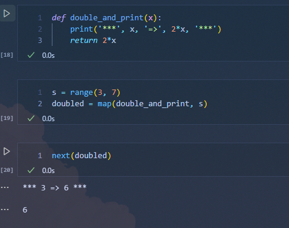

在使用next的时候才会call double_and_print进行计算

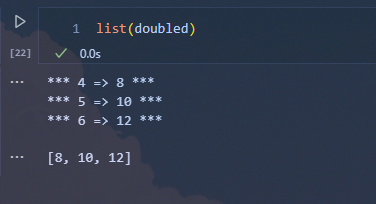

使用list转换的时候，只会保存return的value  
`filter` function returns an iterator over, `zip` and `reversed` functions also return iterators.

### 4.2.4 For Statements

The `for` statement in Python operators on iterators. Objects are iterable if they have an `__iter__` method that returns an iterator. Iterable objects can be the value of the `<expression>` in the header of a `for` statement.

```python
for <name> in <expression>:
    <suite>
```

first evaluates the header `<expression>`. then, the `__iter__` method is invoked on that value. Until a `StopIteration` exception is raised. Python repeatedly invokes the `__next__` method on that iterator and binds the result to the `<name>` in the `for` statement. Then, it executes the `<suite>`

```python
>>> counts = [1, 2, 3]
>>> for item in counts:
        print(item)
1
2
3
```

Implement the execution rule of a `for` statement in terms of `while`, assignment, and `try` statements.

```python
items = counts.__iter__()
try:
    while True:
        item = items.__next__()
        print(item)
except StopIteration:
    pass
1
2
3
```

ps: `try` and `except`, 允许程序在遇到错误时继续运行，而不是直接崩溃

```python
try:
    risky_operation()
except SomeException as e:
    print(f'An error occurred: {e}')
```

`try`块会首先执行，如果遇到异常，会跳转到对应的`except`块执行处理逻辑

1. 捕获特定异常

```python
try:
    num = int(input("Enter a number: "))  # 用户输入非数字会引发 ValueError
except ValueError:
    print("Please enter a valid integer.")
```

2. 捕获多个异常

```python
try:
    result = 10 / int(input("Enter a number: "))  # 可能引发 ZeroDivisionError 或 ValueError
except ZeroDivisionError:
    print("You cannot divide by zero.")
except ValueError:
    print("Invalid input! Please enter a number.")

```

3. 捕获所有异常

```python
try:
    risky_operation()
except Exception as e:
    print(f"An unexpected error occurred: {e}")

```

4. `else`块  
   如果`try`中没有发生异常，则会执行`else`中的代码

```python
try:
    result = 10 / 2
except ZeroDivisionError:
    print("Division by zero error!")
else:
    print(f"Result is {result}")

```

5. `finally`块  
   无论是否发生异常`finally`块中的代码都会执行

```python
try:
    file = open("example.txt", "r")
    content = file.read()
except FileNotFoundError:
    print("File not found!")
finally:
    if 'file' in locals() and not file.closed:
        file.close()  # 确保文件被正确关闭
```

前后都有两个下划线的方法被称为“Magic Methods” or "Special Mehods"，通常与某些特定的功能或行为绑定。

### 4.2.5 Generators and Yield Statements

Generators allow us to define more complicated iterations.

A generator is an ***iterator***           returned by a special class of function called ***generator***           function.

Generator functions are distinguished from regular functions in that rather than containing `return` statements in their body, they use `yield` statement to return elements of a series.

Generators do not use attributes of an object to track their progress through a series. They control the execution of the generator function, which runs until the next `yield` statement is executed each time the generator's `__next__` is invoked.

```python
def letters_genetor():
    current = 'a'
    while current <= 'd':
        yield current
        current = chr(ord(current) + 1)
```

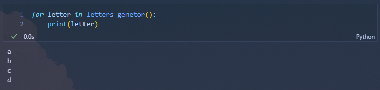

```python
>>> generator_eg = letters_genetor()
>>> generator_eg.__next__()
>>> 'a'
>>> generator_eg.__next__()
>>> 'b'
```

每次调用generator的手都会执行其对应的generator function，直到运行完第一次的yield。

The generator function would return a generator without explicitly define `__iter__` or `__next__` methods, the `yield` statement indicates that we are defining a generator function. The generator function returned by the generator function can return the yielded values.

A generator object has `__iter__` and `__next__` methods, and each call to `__next__` continues execution of the generator function from wherever it left off previously until another `yield` statement is executed.

The first time `__next__` is called, the program executes statements from the body of the `letters_generator` function until it encounters the `yield` statement. Then, it pauses and returns the value of `current.yield` statements do not destroy the newly created environment, they preserve it for later.

### 4.2.6 Iterable Interface

An object is iterable if it returns an iterator when its `__iter__` method is invoked.

### 4.2.7 Creating Iterables with Yield

In Python, iterators only make a single pass over the elements of an underlying series. After that pass, the iterator will continue to raise a `StopIteration` exception when `__next__` is invoked.

New iterable classes can be defined by implementing the iterable interface. `LettersWithYield` class returns a new iterator over letters each time `__iter__` is invoked.

```python
class LettersWithYield:
    def __init__(self, start='a', end='e'):
        self.start = start
        self.end = end
    def __iter__(self):
        next_letter = self.start
        while next_letter < self.end:
            yield next_letter
            next_letter = chr(ord(next_letter) + 1)
```

### Iterator Interface

An iterator can perform arbitary computation to either retrieve or compute next element in response to invoking `__next__`. Python signals that the end of an underlying series has been reached by rasing a `StopTeration` exception during a call to `__next__`

```python
class LetterIter:
    def __init__(self, start='a', end='e'):
        self.next_letter = start
        self.end = end
    def __next__(self):
        if self.next_letter == self.end:
            raise StopIteration
        letter = self.next_letter
        self.next_letter = chr(ord(letter)+1)
        return letter
```

Represent infinite series by implementing a `__next__` method that neverer raises a `StopIteration` exception.

```python
class Positives:
    def __init__(self):
        self.next_positive = 1
    def __next__(self):
        result = self.next_positive
        self.next_positive += 1
        return result
```

**The return of yield**

```python
def partition_gen(n, m):
    assert n > 0 and m > 0
    if n == m:
        yield [m]
    if n - m > 0:
        yield [[m] + partition for partition in partition_gen(n - m, m)]
    if m > 1:
        yield [partition for partition in partition_gen(n, m - 1)]
        
for partition in (partition_gen(6, 4)):
    print(partition)
```

在这个例子中python会输出一个嵌套列表，这是因为iterator每次都会返回一个列表，使用for对iterator对象进行递归并不会递归到列表的内部，而是这个列表本身。例如使用 `yield [1, 2, 3]` 之后对iterator进行递归，则iterator返回的对象是`[1, 2, 3]`而不是`1`

### 4.2.10 Python Streams

**Streams** is a Lazily computed linked list. A `Stream` instance responds to requests for its `first` element and the `rest` of the stream. Like an `Link`, the `rest` of a `Stream` is itself a Stream. Unlike an `Link`, the `rest` of a stream is only computed when it is looked up, rather than being stored in advance. That is, the `rest` of a stream is computed lazily.

A stream stores a function that computes the rest of the stream. Whenever this function is called, its returned value is cached as part of the stream in an attribute called `_rest`, named with an underscore to indicate that it should not be accessed directly.

The accessible attribute `rest` is a property method that returns the rest of the stream, computing it if necessary.

```python
class Stream:
    class empty:
        def __repr__(self):
            return 'Stream empty'
    empty = empty()
    def __init__(self, first, compute_rest=lambda: empty):
        assert callable(compute_rest), 'compute_rest must be callable'
        self.first = first
        self._compute_rest = compute_rest
    @property
    def rest(self):
        if self._compute_rest is not None:
            self._rest = self._compute_rest()
            self._compute_rest = None
        return self._rest
    def __repr__(self):
        return 'Stream({0}, <...>)'.format(repr(self.first))    
```

```python
s = Stream(1, lambda: Stream(2 + 3, lambda: Stream(9)))
```

创建的时候并不会计算`2+3`只有在调用`s.rest`的时候会调用`s.compute_rest`即`lambda: Stream(2+3, lambda: Stream(9))`这时候就会计算出`2+3`的值。


# Extra

## List

### append()

- return `None`
- `==` : return `True` if the content of two lists are same。
- `is`: returrn `True` if the address are same.
- `+`: add another list to the end of the first list.


## 2.8 Efficiency

A more reliable way to characterize the efficiency of a program is to measure how many times some event occurs, rather than measure the time or memory it consumes.

Use `count` function to compute the calling times of some function.

Function can add attributes dynamically.

```python
def fib(n):
    if n == 0:
        return 0
    if n == 1:
        return 1
    return fib(n - 2) + fib(n - 1)

def count(f):
    def counted(*args):
        counted.call_count += 1
        return f(*args)
    counted.call_count = 0
    return counted
```

```python
fib = count(fib)
```

`fib` would call `fib` in the current environment actually.  So when we call new `fib` returned by `count(fib)` , at first `counted.call_count += 1` runs, then the original `fib` would be called. The original `fib` would find `fib` in the current environment and call it.

```python
fib = count(fib)
fib(19)
```

要注意的是，这里的 `fib` 已经不是原先的计算斐波那契数列的函数了，而是我们返回的那个 `counted`。所以流程是：

1. **外层包装函数** **`counted`** **counted** **counted 被调用**:

   - `counted.call_count += 1`
   - 调用原先的 `fib(n)`（在内部，我们可以把它称为原函数，为了不混淆，可以暂时称之为 `original_fib(n)`）

2. **原函数** **`original_fib`** **original_fib** **original_fib(19) 的逻辑**:

   ```python
   def original_fib(n):
       if n == 0:
           return 0
       if n == 1:
           return 1
       return fib(n - 2) + fib(n - 1)  # 注意这里 fib 指向的还是包装后的函数
   ```

   ````
    当 `n = 19` 时，会去计算 `original_fib(17) + original_fib(18)`。但是它并不会直接调用 `original_fib(17)`，而是调用“同一个名字的 `fib`”，而这个 `fib` 也就是外层的 `counted`。这样，新的调用流程又会先执行 `counted.call_count += 1`，再去执行 `original_fib`。
   
    于是，每深入一层递归，就要再调用一次外层的 `counted`，从而让 `call_count` 加 1。
   ````


**Space**

In evaluating an expression, the interpreter preserves all **active environments** and all **values and frames referenced by those environments**. An environment is active if it provides the evaluation context for some expression being evaluated. An environment becomes inactive whenever the function call for which its first frame was created finally returns.

When evaluating `fib`, the interpreter only needs to keep track of those nodes that are above the current node in the tree at any point in the computation. The memory used to compute other branches can be reclaimed. So the space required for tree-recursive functions will be proportional to the maximum depth of the tree.

```python
def count_frames(f):
    def counted(*args):
        counted.open_count += 1
        counted.max_count = max(counted.max_count, counted.open_count)
        result = f(*args)
        counted.open_count -= 1
        return result
    counted.open_count = 0
    counted.max_count = 0
    return counted
```

use function `count_frames` to compute the maximum number of frames that are ever simultaneously active during the course of computation.

### 2.8.2 Memoization

A memoized function will store the return value for any arguments it has previously received. A second call to `fib(25)` would not re-compute the return value recursively, but instead return the existing one that has already been constructed.

**memoization** can be expressed naturally as a higher-order function, which can also be used as a decorator.

```python
def memo(f):
    cache = {}
    def memoized(n):
        if n not in cache:
            cache[n] = f(n)
        return cache[n]
    return memoized
```

```python
counted_fib = count(fib)
fib = memo(counted_fib)
```

### 2.8.3 Orders of Growth

A useful way to analyze a process is to categorization is the **order of growth** of a process.

```python
from math import sqrt
def count_factors(n):
    sqrt_n = sqrt(n)
    k, factors = 1, 0
    while k < sqrt_n:
        if n % k == 0:
            factors += 2
        k += 1
    if k * k == n:
        factors += 1
    return factors
```

The total number of times this process executes the body of the `while` statement is the greatest integer less than $\sqrt{n}$. So the total number of statements executed is $w\cdot \sqrt{n} + v$

**Theta Notation**

$n$is a parameter that measures the size of the input to some process, and let $R(n)$be the amount of some resource that the process requires for an input of size $n$.

$R(n)$has order growth $\Theta(f(n))$, written $R(n)=\Theta(f(n))$, if there are positive constants $k_1$ and $k_2$ independent of $n$such that:

$$
k_1 \cdot f(n) \leq R(n) \leq k_2 \cdot f(n)
$$

```python
def exp_iter(b, n):
    result = 1
    for _ in range(n):
        result = result * b
    return result
    
    
def square(x):
    return x * x

def fast_exp(b, n):
    if n == 0:
        return 1
    if n % 2 == 0:
        return square(fast_exp(b, n // 2))
    else:
        return b * fast_exp(b, n - 1)
```

The first algorithm `exp_iter(b, n)` has a linear complexity, but the second algorithm only has $\Theta (logn)$growth.


# Chapter 3: Interpreting Computer Programs

`Scheme` programming language is a language with a minimal set of features.

Many interpreters have an elegant common structure: two mutually recursive functions. The first evaluates expressions in environment; The second applies functions to arguments.

These functions are recursive in that they are defined in terms of each other: applying a function requires evaluating the expressions in its body, while evaluating an expression may involve applying one or more functions.

## 3.2 Functional Programming

```scheme
(if <predicate> <consequent> <alternative>)
```

**and**

```scheme
(and <e1> ... <en>)
```

**or**

```scheme
(or <e1> ... <en>)
```

**not**

```scheme
(not <e>) 
```

### 3.2.2 Definitions

Values can be named using the `define` special form:

```scheme
(define pi 3.14)
(* pi 2)
```

New functions (called procedures in Scheme) can be defined using a second version of the `define` special form.

```scheme
(define (square x) (* x x))
(define (average x y) (/ (+ x y) 2))
(define (abs x) (if (< x 0) (- x) x))
```

The general form of a procedure definition is

```scheme
(define (<name> <formal parameters>) <body>)
```

An interative procedure for computing square roots using nested definitions and recursion:

```scheme
(define (sqrt x)
  (define (good-enough? guess)
    (< (abs (- (square guess) x)) 0.001))
  (define (improve guess)
    (average guess (/ x guess)))
  (define (sqrt-iter guess)
    (if (good-enough? guess)
        guess
        (sqrt-iter (improve guess))))
  (sqrt-iter 1.0))
(sqrt 9)
```

Anonymous functions are created using the `lambda` special form. `Lambda` is used to create procedures in the same way as `define`, except that no name is specified for the procedure.

```scheme
(lambda (<formal-parameters>) <body>)
```

### 3.2.3 Compound values

```scheme
(define x (cons 1 2))
scm> x
(1 . 2)
scm> (car x)
1
scm> (cdr x)
2
```

Recursive lists are also built into the language, using pairs. A special value denoted `nil` or `()` represents the empty list.

```scheme
(cons 1
      (cons 2
            (cons 3
                  (cons 4 nil))))
```

whether a list is empty can be determined using the primitive `null?` predicate. Compute `length` and selecting elements:

```scheme
(define (length items)
  (if (null? items)
      0
      (+ 1 (length (cdr items)))))
(define (getitem items n)
  (if (= n 0)
      (car items)
      (getitem (cdr items) (- n 1))))
(define squares (list 1 4 9 16 25))
```

### 3.2.4 Symbolic Data

A strength of scheme is working with arbitrary symbols as data. In Scheme, refer to the symbols `a` and `b` rather than their values by preceding them with a single quotation mark.

```scheme
(define a 1)
(define b 2)

(list a b)
(1 2)
(list 'a 'b)
(a b)
(l
(list 'a b)
(a 2)
```

In Scheme, any expression that is not evaluated is said to be `quoted`. 

```scheme
(list `define `list)
```

Quotation also allows us to type in compound objects

```scheme
(car '(a b c))
a
(cdr '(a b c))
(b c)
```

