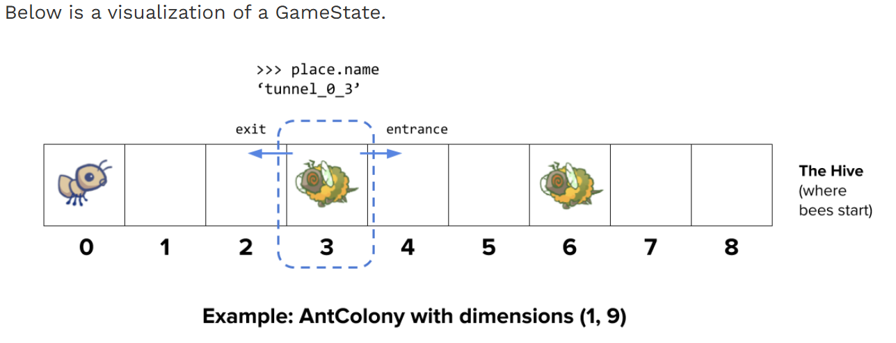

# The Game

End either when a bee reaches the end of the tunnel, the bees destroy a `QueenAnt` if it exists, or the entire bee fleet has been vanquished.

# Core concepts

**The Colony**

1. consists of `Place`s that are chained together to form tunnels through which the bees travel.
2. has some quantity of food which can be expended in order to place an ant in a tunnel.

**Places**

1. A place links to another place to form a tunnel.
2. The player can put a single into each place.
3. However, there can be many bees in a single place.

**Ants**

1. Each type of ant takes different action an requires a different amount of food to place.
2. two basic ant types

   1. `HarvesterAnt`, which adds one food to the colony during each turn.
   2. `ThrowerAnt`, which throws a leaf at a bee each turn

**Bees**

1. advances to the next place in the tunnel if no ant is in its way
2. stings the ant in its way
3. orange bees
4. yellow wasps (double damage)
5. green boss (diffifult to vanquish)

# Phase 1: Basic gameplay

## Problem 0

## Problem 1

## Problem 2

adding code that tracks entrances to the `Place.__init__`

## Problem3

Provided implementation of the `nearest_bee` method in the `ThrowerAnt`class only allows them to hit bees in the same `Place`

Fix `nearest_bee`

# Phase2: More Ants

## Problem4

## Problem5

`FireAnt` reflects damage, does an additional amount of damage(3 damages) when it dies.

1. override `Insect`'s `reduce_health` method. This method should call the `reduce_health` method inherited from the superclass `Ant` which inherits from it's superclass Insect to reduce the current `FireAnt` instance's health.

## Problem6

`BodyguardAnt` `ContainerAnt` `Ant` `BodyguardAnt`

